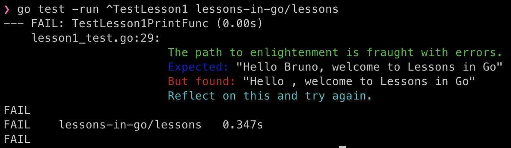

# Lessons in Go(lang)

## Intro

Lessons in Go(lang) was a project I started to convince my friend and colleague Bruno on the virtues of the Go programming
language.

I wanted to convince him to have a look and I remembered how I had enjoyed the Ruby koans when I was first introduced to
it. So I decided to challenge myself to create a similar approach using Go.

You will find many lessons in this repository, I will go more in detail into each one and how to run then below but first
thank you for checking this out, hopefully you find this at least entertaining if not useful.

All the best on your Go voyage ;)

## How to use them

In each lesson I will include the command that needs to be executed in the terminal to run that specific lesson.
Of course you can do it directly via VS Code (or another editor).

The output will be something like this:


I'm considering if I add hints or not, I guess it might depend on each test.

I'm thinking in the future of using a Makefile or having main as an entrypoint so the lessons can be run from the binary,
but for now please follow the individual instructions.

## Lessons

### Lesson One: Funcs and Vars

```
go test -run ^TestLesson1 lessons-in-go/lessons
```

This lessons focus on teaching you the basics of declaring and using vars and funcs.
To pass it you will have to now how to declare variables in Go, the primitive types, how to declare funcs in Go, what are
receivers, signature and returns