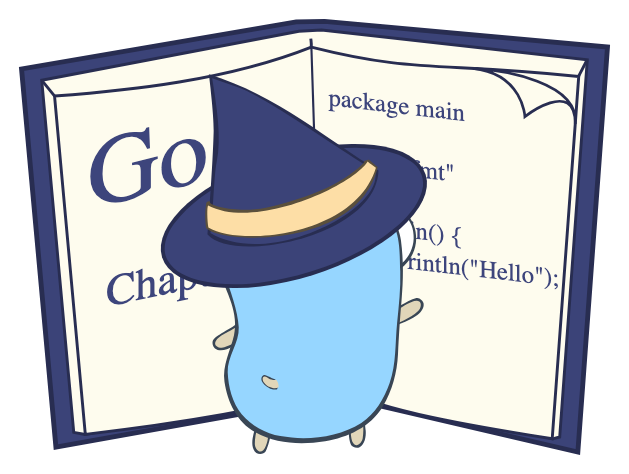
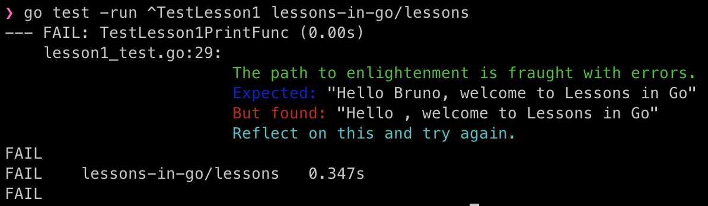

<!-- TOC start (generated with https://github.com/derlin/bitdowntoc) -->

- [Lessons in Go(lang)](#lessons-in-golang)
  - [Intro](#intro)
  - [Installing Go](#installing-go)
  - [How to use them](#how-to-use-them)
  - [Koans](#koans)
    - [1. Introduction and Setup](#1-introduction-and-setup)
    - [2. Basic Syntax and Data Types](#2-basic-syntax-and-data-types)
    - [3. Control Flow and Loops](#3-control-flow-and-loops)
    - [4. Composite Data Structures](#4-composite-data-structures)
    - [5. Functions and Packages](#5-functions-and-packages)
    - [6. Structs, Pointers, and Methods](#6-structs-pointers-and-methods)
    - [7. Interfaces and Composition](#7-interfaces-and-composition)
    - [8. Error Handling, Defer, and Recovery](#8-error-handling-defer-and-recovery)
    - [9. Concurrency and Synchronization](#9-concurrency-and-synchronization)
    - [10. Advanced Concepts and Patterns](#10-advanced-concepts-and-patterns)
    - [11. Real-World Applications and Project Integration](#11-real-world-applications-and-project-integration)

<!-- TOC end -->

<!-- TOC -->
# Lessons in Go(lang)

<!-- TOC -->
## Intro

Lessons in Go(lang) was a project I started to convince my friend and colleague Bruno on the virtues of the Go programming language.

I wanted to convince him to have a look and I remembered how I had enjoyed the *Ruby Koans* when I was first introduced to
it. So I decided to challenge myself to create a similar approach using Go.

All created tests are failing, it is your mission to discover what causes it, change it, run the test again and see if
you've learned your lesson.

You will find many lessons in this repository, I will go more in detail into each one and how to run then below but first
thank you for checking this out, hopefully you find this at least entertaining if not useful.

All the best on your Go voyage ;)

<!-- TOC -->
## Installing Go

Installing Golang on your machine is pretty straightforward, just go [here](https://go.dev/doc/install) and choose the
architecture (Windows, Linux, macOS, etc) that matches your machine.

<!-- TOC -->
## How to use them

In each lesson I will include the command that needs to be executed in the terminal to run that specific lesson.
Of course you can do it directly via VS Code (or another editor).

The output will be something like this:

I'm considering if I add hints or not, I guess it might depend on each test.

I'm thinking in the future of using a Makefile or having main as an entrypoint so the lessons can be run from the binary,
but for now please follow the individual instructions.

<!-- TOC -->
## Koans

<!-- TOC -->
### 1. Introduction and Setup

**Topics Covered:**
- Writing the classic “Hello, World!” program.
- Running your first program.

**Koan Focus:**
- A minimal “Hello, World!” program with deliberate errors (syntax or setup issues) that learners must correct to display “Hello, World!”.

---

<!-- TOC -->
### 2. Basic Syntax and Data Types

**Topics Covered:**
- Variables, constants, and basic types (integers, floats, booleans, and strings).
- Type conversions and simple arithmetic or logical operations.

**Koan Focus:**
- Small programs where incorrect variable declarations or type mismatches cause compile-time or logical errors that the user must fix.

---

<!-- TOC -->
### 3. Control Flow and Loops

**Topics Covered:**
- Conditional statements: `if`, `else`, and `switch`.
- The `for` loop as Go’s only loop mechanism.
- Introduction to `defer` for simple scheduling tasks.

**Koan Focus:**
- Code puzzles where loops run off by one or branch conditions are miswritten, with adjustments required in the control structure to pass tests.

---

<!-- TOC -->
### 4. Composite Data Structures

**Topics Covered:**
- Arrays and Slices: creation, indexing, slicing, and appending.
- Using Maps as key-value stores and performing basic operations on strings.
- Iterating over slices, arrays, and maps with range loops.

**Koan Focus:**
- Examples featuring mishandled array lengths or incorrect slice manipulations that break intended outcomes (e.g., summing elements or printing sequences).

---

<!-- TOC -->
### 5. Functions and Packages

**Topics Covered:**
- Declaring functions, handling return values, and managing multiple return values.
- Variadic functions and anonymous functions (closures).
- Organizing code into packages and using the import statements following Go’s conventions.

**Koan Focus:**
- Puzzles where a function’s signature is mismatched or where the wrong number/type of return values is provided. Correcting the package structure or usage resolves the issues.

---

<!-- TOC -->
### 6. Structs, Pointers, and Methods

**Topics Covered:**
- Defining and using structs for creating custom types.
- Understanding pointers, pointer dereferencing, and the differences between value and pointer semantics.
- Attaching methods to types (using both pointer and value receivers).

**Koan Focus:**
- Exercises that involve subtle pointer pitfalls (such as nil pointer dereferences) or methods that incorrectly mutate state, prompting learners to fix receiver types and pointer usage.

---

<!-- TOC -->
### 7. Interfaces and Composition

**Topics Covered:**
- Defining interfaces and implementing them with concrete types.
- Performing type assertions and using type switches.
- Favoring composition over inheritance by embedding types and promoting method access.

**Koan Focus:**
- Code puzzles where interfaces are improperly satisfied or type assertions fail, challenging learners to correct the contract between types and interfaces.

---

<!-- TOC -->
### 8. Error Handling, Defer, and Recovery

**Topics Covered:**
- Using the `error` type idiomatically, along with creating custom errors.
- Employing `defer` for scheduling cleanup tasks.
- Handling errors gracefully with `panic`/`recover` and adopting error-wrapping practices.

**Koan Focus:**
- Test cases that intentionally mishandle error returns or defer functions in the wrong order, leading learners to restructure their error handling logic.

---

<!-- TOC -->
### 9. Concurrency and Synchronization

**Topics Covered:**
- An introduction to goroutines for lightweight concurrent execution.
- Channel operations, exploring unbuffered versus buffered channels and the use of `select`.
- Advanced synchronization topics including mutexes, WaitGroups, and context (for cancellation and timeout).

**Koan Focus:**
- Concurrency puzzles in which race conditions, deadlocks, or channel mismanagement cause test failures until learners reorganize the concurrency logic.

---

<!-- TOC -->
### 10. Advanced Concepts and Patterns

**Topics Covered:**
- Generics (for Go 1.18+ and later) for creating flexible and type-safe code.
- Reflection for runtime type inspection.
- Functional programming aspects: first-class functions and higher-order functions.
- Object oriented programming aspects: structs instead of classes, composition instead of inheritance and polymorphism

**Koan Focus:**
- Challenges where generic functions misbehave or reflection produces unexpected behavior. This stage can emphasize writing tests first and then refactoring the solution accordingly.

---

<!-- TOC -->
### 11. Real-World Applications and Project Integration

**Topics Covered:**
- File I/O: reading from and writing to files.
- Networking basics (e.g., building a simple web server using the `net/http` package).
- Building command-line applications with Go's flag parsing and package organization.
- Integrating multiple lessons into a cohesive, larger project.

**Koan Focus:**
- A "final koan" where multiple aspects come together. For example, a small CLI tool with unit tests covering error handling, file access, and concurrent operations, which requires learners to refactor and correct the code to satisfy all requirements.